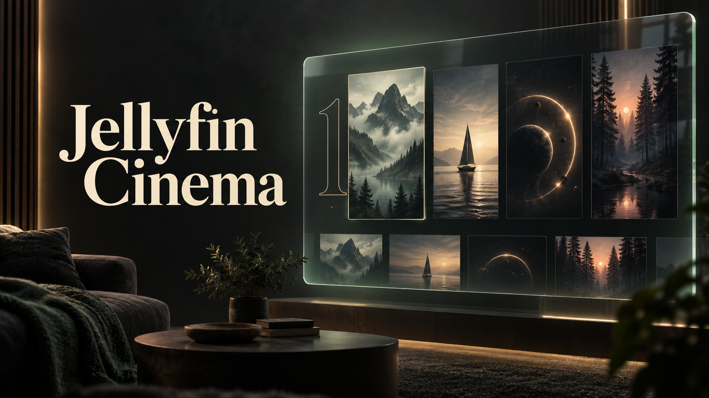

# Jellyfin Cinema



Cinematic browsing for Jellyfin’s **TV layout**, inspired by Netflix and built using the integration and remote-control patterns from [InPlayerEpisodePreview-TV](https://github.com/jampez77/InPlayerEpisodePreview-TV). Formerly **TV Item Layout**, with the same plugin identity and upgrade path.

This plugin brings one cinematic style to Home, Movies, TV Shows, Music, Recordings, Collections and the main Live TV guide. It also includes browsing during video playback and a pause screen. All artwork, metadata, collections, recommendations, favourites and playback positions come from your signed-in Jellyfin library.

## The layouts

- **Home:** cinematic cards with titles and subtitles on the charcoal page surface. Your native user/device section choices and ordering, hidden libraries, latest-media exclusions, Continue listening/reading, Next up options and library destinations stay controlled by Jellyfin. Use **Customize collection rows** to add rows of selected collections or the items in individual collections, with optional numbered artwork. [Jellyfin Featured](https://github.com/spkesDE/jellyfin-featured-plugin) matches the cinematic colours and typography while keeping its own carousel, settings, trailers and remote controls.
- **Music:** albums, album artists, artists, songs, genres, suggestions and favourites, with search and A–Z/#. Open an artist’s albums or an album’s tracks and use Jellyfin’s native audio playback. Now playing opens its native playback controls; Playlists remains accessible through the native page.
- **Recordings:** completed and active recordings, search and pagination, with direct details/playback. The recording schedule and series-recording controls remain available through Jellyfin’s native pages.

- **TV Shows library:** opens Suggestions by default, followed by Favourites, Genres, Collections and **All shows** last. Search and A–Z/# filters help find a title. Suggestions show Jellyfin’s Continue watching, Next up and Recently added items, with episode titles and numbers.
- **TV Show details:** backdrop and title artwork, next-episode/resume action, and a dedicated browser with seasons on the left and episode thumbnails, synopses and watch progress on the right. Down from a season’s last episode opens the next season’s first episode; Up from its first episode opens the previous season’s last. Season and episode detail links open the corresponding show. Scroll down for collection links and More like this recommendations.
- **Movies library:** opens Suggestions by default, followed by Favourites, Genres, Collections and **All movies** last, with search and A–Z/# title filters. Suggestions use Jellyfin’s continue-watching, recently-added and recommendation lists. Browse in pages, open a film and return to the same filters and selected card.
- **Movie details:** a large backdrop, title, Play/Resume, a trailer button with a clapperboard icon, favourites, runtime/rating/quality when available, cast and genres, and a More like this grid. Trailer playback uses Jellyfin’s own trailer action or an available local trailer; unavailable trailers show a clear message. Recommendations open their own detail pages. Collection cards show which collections contain the movie and open their collection pages in the same style.
- **Collections:** a cinematic collections list and individual collection pages with artwork, descriptions and a remote-friendly grid. Use **Add to collection** from media details to choose an existing collection or create one when your account has permission. Existing memberships are shown and refreshed after saving. Open a member or nested collection, then use Back to return to the selected card.
- **Live TV:** current programme, broadcast times and live progress, plus a landscape guide with channel rows and programmes laid out horizontally under a shared time axis. The highlighted programme’s artwork keeps its original proportions on the right and blends into the background, confined above the schedule, with its title, synopsis and live/upcoming status over a left fade. Missing or failed programme artwork falls back to the channel logo. Left/Right moves through a channel’s schedule; Up/Down moves between channels. Select a currently live programme or a channel name to tune that channel. Future programmes show details without changing playback. The hero has no separate Watch live button, and the guide has no channel-count footer.

- **During playback:** Down or the Browse control opens episodes across every available season, similar films, or live channels. A season selector jumps directly to that season’s first available episode; playback changes only when you choose Play/Resume. Left/Right browses, OK plays/resumes, and Back returns to playback. Episode browsing wraps across seasons and the whole series. Cinema intros use the current device’s queue to identify the upcoming feature. A new selection stays open until local playback is confirmed, with a retry if it fails.
- **Pause screen:** Logo/title, metadata, synopsis and optional disc artwork appear when video is paused, without a redundant “Paused” label. Missing logo/disc art can come from the season or series; the synopsis stays with the playing item. The treatment yields to native dialogs and in-player browsing, and disappears on resume.

Working standalone InPlayerEpisodePreview-TV controls take precedence to avoid duplicate previews. A failed or stale preview script no longer blocks Down from opening the integrated browser. The standalone PauseScreen plugin still takes precedence over the integrated pause treatment.

Movie and series pages reveal Jellyfin’s existing theme video behind readable gradients when it is playing. Theme playback remains controlled by Jellyfin’s user settings; the plugin does not start another stream. Static artwork returns when the video is unavailable. Native page controls are hidden visually while our layout is open, while remaining available to Jellyfin’s playback actions.

Open **Live TV** from Jellyfin's navigation (`web/#/livetv?collectionType=livetv`) to use the main guide. **Channels & guide** on a channel's detail page links to that same guide. Use arrows to navigate, **OK / Enter** to select, and **Back / Escape** to return. Episode and guide lists scroll as focus moves. Pointer controls also work.

The plugin activates only in Jellyfin Web’s TV display mode. Desktop and mobile modes retain their normal pages. Web-based TV clients can load it; native clients with independent interfaces cannot. CSS and JavaScript include fallbacks for webOS 6’s Chromium 79 engine. Physical remotes and an actual Jellyfin server still need installation testing.

## Your Home collection rows

On Home, choose **Customize collection rows**. Add a **Collections row** to select and order several collections, or add a **collection items row** for the contents of one collection. You can add several item rows, name and reorder them, and enable **Ranked artwork** separately for each. Large outlined SVG number images appear to the left of the posters; the numbers follow the item order returned by Jellyfin for that collection. They do not calculate popularity or create a top-ten chart.

These choices are saved in this browser’s local storage for the current server and account. They stay on this device/browser and do not sync to other clients; clearing browser storage removes them. Native Jellyfin Home preferences remain separate. You can save up to 12 custom rows, select up to 40 collections in each Collections row, and display up to 60 members in an item row. Larger item rows end with **View full collection**.

## Preview locally

```sh
npm ci
npm run build
npm run dev
```

Open [the local preview](http://127.0.0.1:4173). The controls at the top switch between Home, TV Shows, Movies, Live TV, Collections, Music and Recordings. This preview runs the production layout against fictional library data; playback is explicitly simulated. Its photos are local assets, and it does not connect to a server or need credentials. See [demo scenarios](demo/README.md).

## Install

This source tree is preparing **v0.2.0**; its new packages have not been published yet. The latest published build is the [v0.1.7 test release](https://github.com/jampez77/Jellyfin-TV-Item-Layout/releases/tag/v0.1.7), named **TV Item Layout**, for Jellyfin 10.10.7, 10.11.x and 12.x. See the [0.2.0 release notes](docs/releases/v0.2.0.md) for the changes being prepared.

In **Dashboard → Plugins → Repositories**, add:

```text
https://raw.githubusercontent.com/jampez77/Jellyfin-TV-Item-Layout/main/manifest.json
```

Install the compatible catalogue build, along with a compatible **File Transformation** plugin, then restart Jellyfin. Published 0.1.7 builds display **TV Item Layout**; 0.2.0 uses **Jellyfin Cinema**. Existing installs use the same plugin ID, assembly and catalogue URL, so the rename follows the normal update path when 0.2.0 is published. Enable **TV** display mode in your Jellyfin Web user settings. See the [installation guide](docs/server.md) for the File Transformation repository, manual installation, and troubleshooting. No web files are silently modified.

To build the packages locally:

```sh
bash scripts/package-plugin.sh all
```

For the prepared 0.2.0 release, the final plugin version component identifies the server target: `0.2.0.1` for 10.10.7, `0.2.0.2` for 10.11.x and `0.2.0.3` for 12.x. Archives retain their `TvItemLayout_…` names. Release preparation is documented in [publishing](docs/publishing.md).

## Verify

```sh
npm run typecheck
npm test
npm run build
npx playwright install chromium
npm run test:browser
dotnet run --project server/verification/TvItemLayout.ServerChecks.csproj --configuration Release
```

The browser suite exercises the actual layout against a simulated Jellyfin API. Server checks exercise injection, script delivery and caching on a temporary local HTTP host. These checks do not establish real-server playback or hardware compatibility.

The Featured compatibility tests additionally run its unmodified frontend with fixture API responses and a generated local trailer. To enable them, provide the audited checkout; otherwise those tests explicitly skip:

```sh
git clone https://github.com/spkesDE/jellyfin-featured-plugin.git /tmp/tvl-featured-audit
git -C /tmp/tvl-featured-audit checkout 2cb03c5360cc39836bc0f7c283752c9398eb50b9
TVL_FEATURED_SOURCE=/tmp/tvl-featured-audit npx playwright test tests/browser/featured-home.spec.ts
```

Its server-side feed generation and external trailer providers are not covered by these fixtures. Native Home tests run without the external checkout.

## Project structure

| Path | Purpose |
| --- | --- |
| `src/view.ts`, `src/style.css` | Media layouts, loading/empty/error states and actions |
| `src/remote.ts` | Focus navigation and remote key handling |
| `src/guide-view.ts`, `src/guide.ts`, `src/guide.css` | Main Live TV page, horizontal guide and timeline navigation |
| `src/library-view.ts`, `src/library.css` | Shared Movies and TV Shows filters, suggestions and paginated browsing |
| `src/collection-view.ts`, `src/collection.css` | Collections list and member browsing |
| `src/collection-picker.ts` | Create collections and add media from detail pages |
| `src/api.ts`, `src/local-playback.ts` | Authenticated Jellyfin data and native playback bridge |
| `src/browse-api.ts`, `src/browse-view.ts`, `src/browse.css` | Music and Recordings |
| `src/home.css` | Native Home styling that preserves user/device preferences and Featured |
| `src/home-collections.ts`, `src/home-collection-settings.ts`, `src/home-collections.css` | Custom Home collection rows, local preferences and numbered artwork |
| `src/player-context.ts`, `src/player-browser.ts` | Active playback identity, queues and in-player navigation |
| `src/pause-screen.ts`, `src/pause-screen.css` | Pause artwork and metadata |
| `src/native-host.ts`, `src/native-host.css` | Native page visibility and restoration |
| `src/index.ts`, `src/theme-video.ts` | Route lifecycle, native theme-video visibility and page restoration |
| `server/` | Independent server plugin and File Transformation integration |
| `demo/` | Offline fixture and artwork |

## Credits

Integration and local playback code are adapted from [jampez77/InPlayerEpisodePreview-TV](https://github.com/jampez77/InPlayerEpisodePreview-TV), based on [Namo2/InPlayerEpisodePreview](https://github.com/Namo2/InPlayerEpisodePreview). The pause-screen behavior is independently implemented from [jampez77/Jellyfin-PauseScreen](https://github.com/jampez77/Jellyfin-PauseScreen); its code is not copied. Original MIT notices for InPlayerEpisodePreview are retained in [LICENSE.md](LICENSE.md) and the packaged server licence. The TV design takes inspiration from the supplied Netflix [overview](https://techwiser.com/wp-content/uploads/2023/01/Netflix-Smart-TV-More-episodes.jpg) and [season browser](https://techwiser.com/wp-content/uploads/2023/01/Netflix-Smart-TV-Change-season.jpg), and the supplied movie reference. No Netflix branding, film artwork, or fabricated ranking data is bundled. Demo photo sources are listed in [artwork credits](demo/assets/CREDITS.md).
